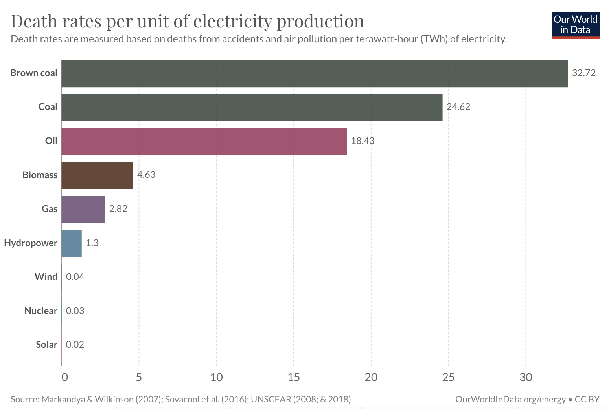

# Huge comeback for the Nuclear Energy

Nuclear Energy, come to me

## Facts

1. **Reliable**: The nuclear plants can operate on a continuous way, producing energy by 93% of the time during the year.

2. **Abundant**: There´s enough known resources and economically explodable of uranium to supply the needs of energy for many decades to go, even centuries. Also, think that nuclear energy is extremly efficient in terms of energetic density.

3. **Carbon-free**: Nuclear power does not produce direct greenhouse gas emissions during electricity generation.

### Did you know that it is one of the safest?

But It doesn´t make sense, well it does. There have been no deaths in the US from commercial nuclear power.

Check out this chart:

*Source: Our World in Data*

## Fission already good, but fusion it is mindblowing

What do you mean with fission and fusion? Let me explain.
All the nuclear reactors active right now work using **nuclear fission**, this is a reaction that happens when the core of an atom divides in two or more fragments of smaller in size.

On the other side, **nuclear fusion**, and this one happens when multiple atomic nuclei join together and they make one heavier. The best example, is the fussion of hydrogen that forms helium, wich makes stars, like the Sun, shine. It´s as you see, a super energy generator. Definetly we will see it working in the future.

Nuclear fusion it is still in development, and in active research. There´s one nuclear plant that it is being built in France. Check <a style="color: lightBlue" href="https://www.iaea.org/bulletin/iter-the-worlds-largest-fusion-experiment" target="_blank">IAEA article</a> for more information about this international project.

## Misunderstandings

Before I start, i want to say that *Julia DeWahl* in her article called <a style="color: lightBlue" href="https://juliadewahl.com/nuclear-energy-past-present-future" target="_blank">*"Nuclear energy: past, present and future"*</a> clarifies with more detailed, and straight information. I will link all of my resources below of this blog.

If we go to the "most famous case", Chernobyl, we can see that the power plant wasn´t prepared for emergency situations (it didn't have a containment dome), and the operating team was an experiment, and they switched off safety mechanisms.

Germany closed all the power plants that were working, and know relies on France on imported fossil fuels. It shocked me when I see this data, because Germany is one of the countries persuing change towards better relationship with the enviroment and they made this decision.

### What about the waste the power plants produce?

The most basic way to contain this, and not throw it away, it's to keep it contained and secure. But something really interesting about the Nuclear waste is that is really tiny in volume. All of the nuclear waste in the US could fit on a football field, stacked less than 10 yards high. Also it has never killed or injured anyone.

And something new came up. Spent fuel can be recycled and used again as fuel in reactors. But it is not been used widely yet.

#### Resources

1. https://juliadewahl.com/nuclear-energy-past-present-future
2. https://tierrasustentable.com/ambiente/energia-nuclear-que-es-ventajas-y-desventajas-de-su-uso/
3. https://www.ngenespanol.com/ciencia/cual-es-la-diferencia-entre-fusion-nuclear-y-fision-nuclear/
4. https://www.iaea.org/newscenter/news/what-is-nuclear-fusion
5. https://www.iaea.org/bulletin/iter-the-worlds-largest-fusion-experiment